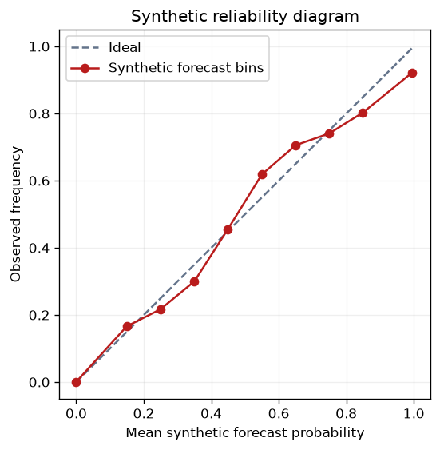

# VayuGati Verification Report

SYNTHETIC RECONSTRUCTIONS only; these are not real radar reanalysis or operational forecasts. Scores compare Farneback advection with a frozen persistence baseline. The domain is 384 x 384 km-equivalent pixels, and each case uses 20 deterministic random seeds.

## 60-minute CSI (mean +/- standard deviation)

| Case | Nowcast CSI | Persistence CSI | Nowcast POD | Nowcast FAR | FSS r=1 | FSS r=3 | FSS r=5 | FSS r=10 |
|---|---:|---:|---:|---:|---:|---:|---:|---:|
| DECAYING storm | 0.216 +/- 0.007 | 0.063 +/- 0.004 | 1.000 | 0.784 | 0.390 | 0.439 | 0.463 | 0.455 |
| Fast squall line | 0.866 +/- 0.009 | 0.018 +/- 0.001 | 0.877 | 0.014 | 0.976 | 0.987 | 0.990 | 0.991 |
| GROWING storm | 0.711 +/- 0.006 | 0.144 +/- 0.002 | 0.711 | 0.000 | 0.888 | 0.933 | 0.949 | 0.957 |
| Moderate coastal line | 0.906 +/- 0.004 | 0.089 +/- 0.002 | 0.923 | 0.020 | 0.983 | 0.992 | 0.995 | 0.997 |
| Orographic quasi-stationary | 0.905 +/- 0.003 | 0.802 +/- 0.002 | 0.934 | 0.033 | 0.973 | 0.985 | 0.990 | 0.994 |
| Splitting/merging cells | 0.925 +/- 0.006 | 0.331 +/- 0.002 | 0.956 | 0.034 | 0.990 | 0.996 | 0.997 | 0.998 |

## CSI by lead time (all-case mean +/- standard deviation)

| Lead (min) | Nowcast CSI | Persistence CSI |
|---:|---:|---:|
| 15 | 0.910 +/- 0.077 | 0.629 +/- 0.213 |
| 30 | 0.845 +/- 0.169 | 0.438 +/- 0.266 |
| 60 | 0.755 +/- 0.275 | 0.241 +/- 0.296 |
| 120 | 0.661 +/- 0.339 | 0.117 +/- 0.259 |
| 180 | 0.610 +/- 0.317 | 0.085 +/- 0.207 |
| 360 | 0.451 +/- 0.251 | 0.039 +/- 0.096 |

## Reliability diagram

Probabilities are a synthetic reflectivity-threshold diagnostic, not calibrated ML probabilities.

| Forecast probability | Samples | Observed frequency |
|---|---:|---:|
| 0.0-0.1 | 104849048 | 0.001 |
| 0.1-0.2 | 82255 | 0.166 |
| 0.2-0.3 | 79375 | 0.217 |
| 0.3-0.4 | 78741 | 0.300 |
| 0.4-0.5 | 77279 | 0.456 |
| 0.5-0.6 | 75381 | 0.619 |
| 0.6-0.7 | 75134 | 0.705 |
| 0.7-0.8 | 74727 | 0.741 |
| 0.8-0.9 | 64528 | 0.802 |
| 0.9-1.0 | 711852 | 0.922 |

## Known limitations

- Truth is synthetic and generated from prescribed motion/evolution; it is not observed weather.
- The nowcast is advection-only and has no growth or decay physics; it can legitimately lose to persistence in decaying or growing cases.
- Results are not operational skill estimates and do not replace radar-based independent verification.
- The 384 x 384 km-equivalent test domain reduces domain-exit artifacts but does not represent a geographic projection.

## Real-data verification (IMERG Final Run, archived)

IMERG Final Run V07 is satellite-derived and includes morphing/advection-based processing; this is not an independent operational-radar test. Its approximately 10 km grid is coarser than the 1-3 km target display resolution. Metrics compare local archived half-hourly fields only; no runtime archive download is attempted. Scores use pixels valid in both fields and report their valid-area fraction.

| Case | Lead (min) | Threshold (mm/h) | Nowcast CSI | Persistence CSI | POD | FAR | FSS | Bias | Valid area | Samples |
|---|---:|---:|---:|---:|---:|---:|---:|---:|---:|---:|
| leh_2010_08_05 | 30 | 0.5 | 0.593 +/- 0.122 | 0.593 +/- 0.122 | 0.739 | 0.262 | 0.953 | 1.002 | 1.000 | 59 |
| leh_2010_08_05 | 30 | 1.0 | 0.553 +/- 0.137 | 0.553 +/- 0.137 | 0.705 | 0.297 | 0.942 | 1.002 | 1.000 | 59 |
| leh_2010_08_05 | 30 | 2.0 | 0.488 +/- 0.161 | 0.488 +/- 0.161 | 0.643 | 0.360 | 0.921 | 1.004 | 1.000 | 59 |
| leh_2010_08_05 | 30 | 5.0 | 0.301 +/- 0.165 | 0.301 +/- 0.165 | 0.441 | 0.555 | 0.817 | 1.027 | 1.000 | 59 |
| leh_2010_08_05 | 60 | 0.5 | 0.474 +/- 0.132 | 0.474 +/- 0.132 | 0.635 | 0.366 | 0.897 | 1.002 | 1.000 | 58 |
| leh_2010_08_05 | 60 | 1.0 | 0.423 +/- 0.148 | 0.424 +/- 0.148 | 0.585 | 0.419 | 0.871 | 1.003 | 1.000 | 58 |
| leh_2010_08_05 | 60 | 2.0 | 0.345 +/- 0.162 | 0.345 +/- 0.162 | 0.497 | 0.507 | 0.823 | 1.003 | 1.000 | 58 |
| leh_2010_08_05 | 60 | 5.0 | 0.170 +/- 0.122 | 0.172 +/- 0.123 | 0.274 | 0.717 | 0.654 | 0.997 | 1.000 | 58 |
| leh_2010_08_05 | 90 | 0.5 | 0.404 +/- 0.129 | 0.405 +/- 0.129 | 0.570 | 0.433 | 0.837 | 1.005 | 1.000 | 57 |
| leh_2010_08_05 | 90 | 1.0 | 0.348 +/- 0.142 | 0.349 +/- 0.142 | 0.508 | 0.498 | 0.795 | 1.006 | 1.000 | 57 |
| leh_2010_08_05 | 90 | 2.0 | 0.265 +/- 0.144 | 0.266 +/- 0.144 | 0.407 | 0.598 | 0.719 | 1.003 | 1.000 | 57 |
| leh_2010_08_05 | 90 | 5.0 | 0.106 +/- 0.088 | 0.108 +/- 0.089 | 0.182 | 0.809 | 0.506 | 0.998 | 1.000 | 57 |
| leh_2010_08_05 | 120 | 0.5 | 0.354 +/- 0.126 | 0.354 +/- 0.126 | 0.519 | 0.485 | 0.780 | 1.010 | 1.000 | 56 |
| leh_2010_08_05 | 120 | 1.0 | 0.293 +/- 0.133 | 0.294 +/- 0.133 | 0.447 | 0.561 | 0.721 | 1.010 | 1.000 | 56 |
| leh_2010_08_05 | 120 | 2.0 | 0.213 +/- 0.122 | 0.215 +/- 0.121 | 0.345 | 0.660 | 0.625 | 1.003 | 1.000 | 56 |
| leh_2010_08_05 | 120 | 5.0 | 0.064 +/- 0.060 | 0.068 +/- 0.063 | 0.119 | 0.877 | 0.393 | 0.997 | 1.000 | 56 |
| leh_2011_07_25 | 30 | 0.5 | 0.637 +/- 0.107 | 0.637 +/- 0.107 | 0.777 | 0.228 | 0.947 | 1.012 | 1.000 | 35 |
| leh_2011_07_25 | 30 | 1.0 | 0.579 +/- 0.140 | 0.579 +/- 0.140 | 0.734 | 0.282 | 0.925 | 1.027 | 1.000 | 35 |
| leh_2011_07_25 | 30 | 2.0 | 0.520 +/- 0.189 | 0.520 +/- 0.189 | 0.684 | 0.348 | 0.876 | 1.070 | 1.000 | 35 |
| leh_2011_07_25 | 30 | 5.0 | 0.450 +/- 0.217 | 0.449 +/- 0.217 | 0.614 | 0.427 | 0.807 | 1.197 | 1.000 | 35 |
| leh_2011_07_25 | 60 | 0.5 | 0.507 +/- 0.117 | 0.508 +/- 0.117 | 0.672 | 0.334 | 0.891 | 1.020 | 1.000 | 34 |
| leh_2011_07_25 | 60 | 1.0 | 0.443 +/- 0.150 | 0.443 +/- 0.150 | 0.616 | 0.409 | 0.845 | 1.048 | 1.000 | 34 |
| leh_2011_07_25 | 60 | 2.0 | 0.377 +/- 0.194 | 0.377 +/- 0.194 | 0.549 | 0.497 | 0.766 | 1.128 | 1.000 | 34 |
| leh_2011_07_25 | 60 | 5.0 | 0.303 +/- 0.187 | 0.304 +/- 0.188 | 0.470 | 0.586 | 0.672 | 1.444 | 1.000 | 34 |
| leh_2011_07_25 | 90 | 0.5 | 0.423 +/- 0.117 | 0.423 +/- 0.117 | 0.594 | 0.413 | 0.833 | 1.031 | 1.000 | 33 |
| leh_2011_07_25 | 90 | 1.0 | 0.356 +/- 0.152 | 0.356 +/- 0.152 | 0.529 | 0.502 | 0.769 | 1.069 | 1.000 | 33 |
| leh_2011_07_25 | 90 | 2.0 | 0.294 +/- 0.186 | 0.294 +/- 0.187 | 0.459 | 0.596 | 0.673 | 1.187 | 1.000 | 33 |
| leh_2011_07_25 | 90 | 5.0 | 0.217 +/- 0.178 | 0.218 +/- 0.179 | 0.371 | 0.701 | 0.562 | 1.601 | 1.000 | 33 |
| leh_2011_07_25 | 120 | 0.5 | 0.360 +/- 0.115 | 0.360 +/- 0.115 | 0.527 | 0.477 | 0.775 | 1.030 | 1.000 | 32 |
| leh_2011_07_25 | 120 | 1.0 | 0.287 +/- 0.149 | 0.287 +/- 0.150 | 0.449 | 0.583 | 0.688 | 1.078 | 1.000 | 32 |
| leh_2011_07_25 | 120 | 2.0 | 0.226 +/- 0.175 | 0.226 +/- 0.176 | 0.377 | 0.684 | 0.576 | 1.201 | 1.000 | 32 |
| leh_2011_07_25 | 120 | 5.0 | 0.154 +/- 0.156 | 0.157 +/- 0.159 | 0.288 | 0.788 | 0.451 | 1.603 | 1.000 | 32 |
